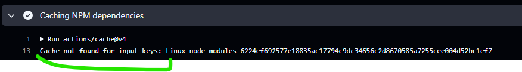
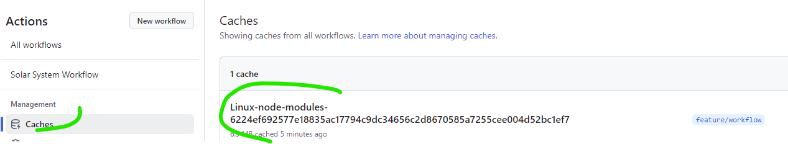
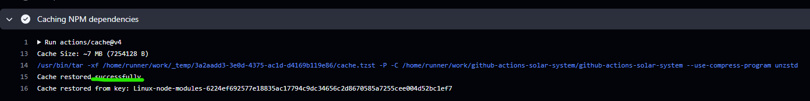
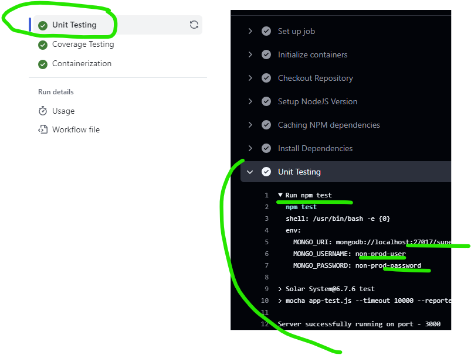
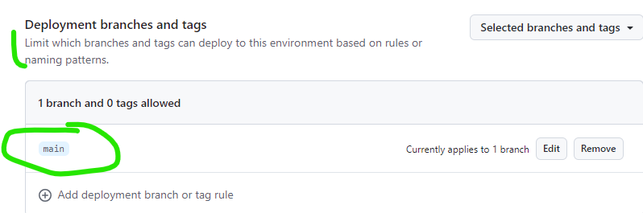
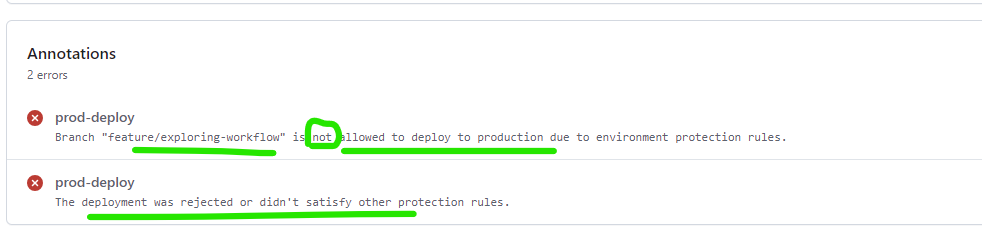
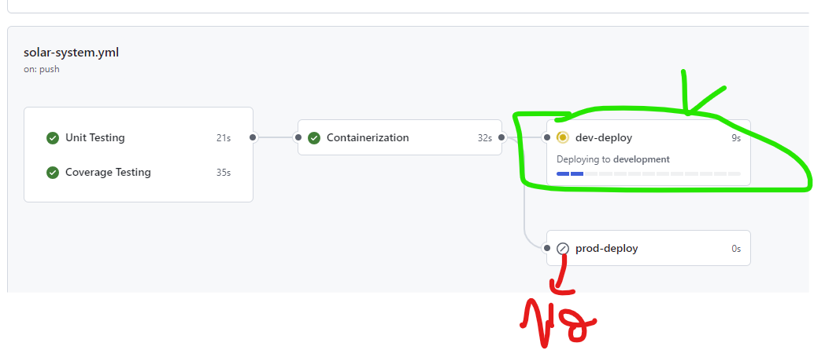
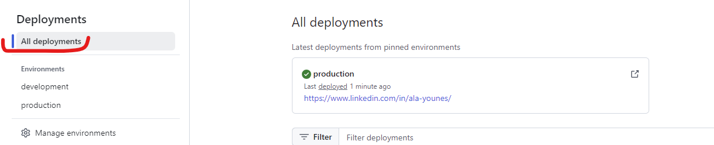

# Solar System NodeJS Application
## Using cache
- First time running cache :


- Cache craeted : 


- Cache found successfully :


### GHCR 
- GITHUB_TOKEN is automatically generated in the secrets (no need to manually put it) => secrets.GITHUB_TOKEN
- When creating a package on ghcr using docker further permissions can be demanded ``` permissions: packages: write ```

### Some best practices (Alice saw that the data base was more adn more sluggish)
- Database more sluggish beceause we are suing the production database with github actions and tests
- We do not use productiondatabase for testing or code coverage puposes.
=> **Solution :** Service Containers (ithub actions container to mock the database)

### About service containers
You can use service containers to connect databases, web services, memory caches, and other tools to your workflow.

```bash
services:
      mongo-db:
        image: siddharth67/mongo-db:non-prod # Whatever image you have already built to run tests ...credentials:
        ports:
          - 27017:27017
    env: # Here is the credentials to access the service container
      MONGO_URI: 'mongodb://localhost:27017/superData'
      MONGO_USERNAME: non-prod-user
      MONGO_PASSWORD: non-prod-password
    steps:
      - name: Unit Testing
        run: npm test
```

- Now the npm test is using the service container as a database


```bash
  # Two containers (from container and from service) [Container to container communication -> No need for port mapping]
    container: 
      image: node:18
    services:
      mongo-db:
        image: siddharth67/mongo-db:non-prod # Whatever image you have already built to run tests ...credentials:
        options: 
          --name mongo
    env: # Here is the credentials to access the service container (As we can see we used the name instead of the port number)
      MONGO_URI: 'mongodb://mongo:27017/superData'
      MONGO_USERNAME: non-prod-user
      MONGO_PASSWORD: non-prod-password
```

### By updating the workflow using job and service containers, the load on the production database has been reduced

# Kubernetes
- By default kubectl needs a kubeconfig file in order to run. 
- A **Kubeconfig** is a YAML file with all the Kubernetes cluster details, certificates, and secret tokens to authenticate the cluster. You might get this config file directly from the **cluster administrator** or from a **cloud platform** if you are using a managed Kubernetes cluster.
- If you want to try on local envirement use the act : [Run your GitHub Actions locally!](https://github.com/nektos/act)!

# Many ways to restrict the workflow from running or enhance secruty :
- We can use the envirenemnt onglet on github UI ti impose some rules like : 



- Or we can use conditional expressions in order to run a certain job
``` bash 
if: contains(github.ref, 'feature/')

if: github.ref == 'refs/heads/main'
```


- A nice view of what was deployed : 



---
### kubeconfig File
```bash
apiVersion: v1
clusters:
- cluster:
    certificate-authority-data: LS0tLS1CRUdJTiBDRVJUSUZJQ0FURS0tLS0tCk1JSUJlRENDQVIyZ0F3SUJBZ0lCQURBS0JnZ3Foa2pPUFFRREFqQWpNU0V3SHdZRFZRUUREQmhyTTNNdGMyVnkKZG1WeUxXTmhRREUzTWpZNE16WTJNVGt3SGhjTk1qUXdPVEl3TVRJMU1ERTVXaGNOTXpRd09URTRNVEkxTURFNQpXakFqTVNFd0h3WURWUVFEREJock0zTXRjMlZ5ZG1WeUxXTmhRREUzTWpZNE16WTJNVGt3V1RBVEJnY3Foa2pPClBRSUJCZ2dxaGtqT1BRTUJCd05DQUFTaklYK3V2cDFtbm5rcFBxOHRydEhlN0JFRGVxNDluRFhvTHowZjVuTzMKKzhxTFp1eG1DaXFTb0pIY2pjSGI4dHNrZm1pN1FsTXBCUTVrMEQzbEF5TkNvMEl3UURBT0JnTlZIUThCQWY4RQpCQU1DQXFRd0R3WURWUjBUQVFIL0JBVXdBd0VCL3pBZEJnTlZIUTRFRmdRVU5NblNRUndRby91SmRUQkNDaWlvCmU4Ky9JSlF3Q2dZSUtvWkl6ajBFQXdJRFNRQXdSZ0loQU5qN1o2VXlkU2tzd21lSHo5eTlLUGdhYVphM1JXS1MKUUJuWjRKaWVrRnVRQWlFQTNOY0pZTjg1V2FwQ2dER1BtZll3Mkp1b2pTOFdXdmRqQkE4eTFvVTVRTEE9Ci0tLS0tRU5EIENFUlRJRklDQVRFLS0tLS0K
    server: https://127.0.0.1:6443
  name: default
contexts:
- context:
    cluster: default
    user: default
  name: default
current-context: default
kind: Config
preferences: {}
users:
- name: default
  user:
    client-certificate-data: LS0tLS1CRUdJTiBDRVJUSUZJQ0FURS0tLS0tCk1JSUJrakNDQVRlZ0F3SUJBZ0lJQVcxTEtxbkFpdWt3Q2dZSUtvWkl6ajBFQXdJd0l6RWhNQjhHQTFVRUF3d1kKYXpOekxXTnNhV1Z1ZEMxallVQXhOekkyT0RNMk5qRTVNQjRYRFRJME1Ea3lNREV5TlRBeE9Wb1hEVEkxTURreQpNREV5TlRBeE9Wb3dNREVYTUJVR0ExVUVDaE1PYzNsemRHVnRPbTFoYzNSbGNuTXhGVEFUQmdOVkJBTVRESE41CmMzUmxiVHBoWkcxcGJqQlpNQk1HQnlxR1NNNDlBZ0VHQ0NxR1NNNDlBd0VIQTBJQUJJYmE2aUovVzJYQm1OYS8KNFJnbHFqak5BY3RJdERHbGhVNmU1b3JIOG9GYjFaTjJtaDJVTWkvVks3ZEh0Wk12RzBFbDJISWJ5a1JWNjVXOApNeEpVdDdhalNEQkdNQTRHQTFVZER3RUIvd1FFQXdJRm9EQVRCZ05WSFNVRUREQUtCZ2dyQmdFRkJRY0RBakFmCkJnTlZIU01FR0RBV2dCUWJoTFBBeWVHMDlsaExneDlHc05UbTlFNDZ1VEFLQmdncWhrak9QUVFEQWdOSkFEQkcKQWlFQTByakNmaVVKWCsxQmlHMCtxZnUrcndUNDErSHM0NXBEaEpTZXJzdTVMaUlDSVFET1UydS8rR1JrYlg3bQp0ME5JK2ExSjQrVkl1a09Udy9oOXRGWnJZZnRMOFE9PQotLS0tLUVORCBDRVJUSUZJQ0FURS0tLS0tCi0tLS0tQkVHSU4gQ0VSVElGSUNBVEUtLS0tLQpNSUlCZHpDQ0FSMmdBd0lCQWdJQkFEQUtCZ2dxaGtqT1BRUURBakFqTVNFd0h3WURWUVFEREJock0zTXRZMnhwClpXNTBMV05oUURFM01qWTRNelkyTVRrd0hoY05NalF3T1RJd01USTFNREU1V2hjTk16UXdPVEU0TVRJMU1ERTUKV2pBak1TRXdId1lEVlFRRERCaHJNM010WTJ4cFpXNTBMV05oUURFM01qWTRNelkyTVRrd1dUQVRCZ2NxaGtqTwpQUUlCQmdncWhrak9QUU1CQndOQ0FBVGU1VEo1aW1WMVVKdFZuZnNqdjdOdFRKSWJnWTQ1bmtrZlJhdTMvZXEwCnluajFSRjdGWC8yUUFWaGhFaVpld2dTSFhRMUlJRXZFSEQrWTV6Qk5NR2svbzBJd1FEQU9CZ05WSFE4QkFmOEUKQkFNQ0FxUXdEd1lEVlIwVEFRSC9CQVV3QXdFQi96QWRCZ05WSFE0RUZnUVVHNFN6d01uaHRQWllTNE1mUnJEVQo1dlJPT3Jrd0NnWUlLb1pJemowRUF3SURTQUF3UlFJaEFKZjRnMTh2ZnZZMWJSb3IzRENvY3VUR05wRmxENDArCktFcThpVTZQZTJRVEFpQTgyQ09uaVFUVnJhZWI1d3VYdDlaUlFtdlAvMlJhQ05VVG4vdUU5MWpBM0E9PQotLS0tLUVORCBDRVJUSUZJQ0FURS0tLS0tCg==
    client-key-data: LS0tLS1CRUdJTiBFQyBQUklWQVRFIEtFWS0tLS0tCk1IY0NBUUVFSU1IbmNSR0VIemI4dGFqemRUZVRCZEhuejdvZ1VJYzZ2RzYrYUgwM1RYSHJvQW9HQ0NxR1NNNDkKQXdFSG9VUURRZ0FFaHRycUluOWJaY0dZMXIvaEdDV3FPTTBCeTBpME1hV0ZUcDdtaXNmeWdWdlZrM2FhSFpReQpMOVVydDBlMWt5OGJRU1hZY2h2S1JGWHJsYnd6RWxTM3RnPT0KLS0tLS1FTkQgRUMgUFJJVkFURSBLRVktLS0tLQo=
```